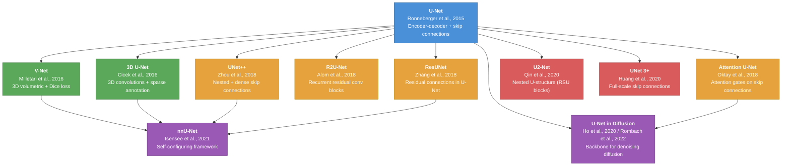

# 02 - U-Net Family

A comprehensive collection of reviews covering the U-Net architecture and its many descendants. From the original 2015 paper through modern adaptations in diffusion models, this module traces how the encoder-decoder design with skip connections became the dominant paradigm in biomedical image segmentation and beyond.

---

## Table of Contents

1. [Family Tree](#family-tree)
2. [Papers in This Module](#papers-in-this-module)
3. [Reading Order](#reading-order)
4. [Key Themes](#key-themes)
5. [Directory Structure](#directory-structure)

---

## Family Tree



**Legend:**
- Blue: Foundational architecture
- Green: Early 3D extensions (2016)
- Orange: Architectural innovations (2018)
- Red: Advanced nested/multi-scale designs (2020)
- Purple: Frameworks and cross-domain applications (2020+)

---

## Papers in This Module

| # | Paper | Year | Key Contribution | Difficulty |
|---|-------|------|------------------|------------|
| 1 | U-Net (Original) | 2015 | Encoder-decoder with skip connections | Beginner |
| 2 | V-Net | 2016 | Volumetric 3D segmentation, Dice loss | Beginner |
| 3 | 3D U-Net | 2016 | 3D convolutions, sparse annotation | Beginner |
| 4 | Attention U-Net | 2018 | Attention gates for skip connections | Intermediate |
| 5 | UNet++ | 2018 | Nested dense skip pathways | Intermediate |
| 6 | R2U-Net | 2018 | Recurrent residual convolutional blocks | Intermediate |
| 7 | ResUNet | 2018 | Residual learning in U-Net | Intermediate |
| 8 | U2-Net | 2020 | Nested U-structure with RSU blocks | Intermediate |
| 9 | UNet 3+ | 2020 | Full-scale skip connections | Intermediate |
| 10 | nnU-Net | 2021 | Self-configuring segmentation framework | Advanced |
| 11 | U-Net in Diffusion Models | 2020-2022 | Denoising backbone in generative models | Advanced |

---

## Reading Order

**Recommended path:**

1. **Start with the original**: `unet_original/` -- understand the foundational encoder-decoder + skip connection design.
2. **3D extensions**: `vnet/` and `3d_unet/` -- see how the architecture generalizes to volumetric data.
3. **Skip connection improvements**: `attention_unet/` then `unetpp/` -- learn how skip connections evolved.
4. **Block-level innovations**: `r2unet/`, `resunet/` -- understand recurrent and residual modifications.
5. **Nested architectures**: `u2net/`, `unet3plus/` -- explore multi-scale nested designs.
6. **The framework**: `nnunet/` -- see how engineering and automation surpass architectural novelty.
7. **Beyond segmentation**: `unet_in_diffusion/` -- discover U-Net as the backbone of diffusion models.

---

## Key Themes

- **Skip connections** are the defining feature -- every variant improves or reimagines them.
- **3D generalization** was an early and natural extension for medical imaging.
- **Attention mechanisms** selectively weight features passed through skip connections.
- **Nested and dense connectivity** capture multi-scale features more effectively.
- **Self-configuring pipelines** (nnU-Net) show that good engineering can matter more than architecture.
- **Cross-domain transfer** -- the U-Net backbone proves essential in diffusion-based generative models.

---

## Directory Structure

```
02_unet_family/
├── README.md
├── _registry.yaml
├── unet_original/
│   ├── review.md
│   ├── architecture.md
│   ├── architecture_diagram.mermaid
│   └── key_equations.md
├── vnet/
│   ├── review.md
│   └── 3d_conv_explained.md
├── 3d_unet/
│   ├── review.md
│   └── sparse_annotation_strategy.md
├── attention_unet/
│   ├── review.md
│   ├── attention_gate_mechanism.md
│   └── attention_visualization.md
├── unetpp/
│   ├── review.md
│   ├── nested_skip_analysis.md
│   ├── deep_supervision.md
│   └── pruning_at_inference.md
├── r2unet/
│   ├── review.md
│   └── recurrent_conv_explained.md
├── resunet/
│   ├── review.md
│   └── residual_vs_plain_comparison.md
├── u2net/
│   ├── review.md
│   └── rsu_block_analysis.md
├── unet3plus/
│   ├── review.md
│   └── full_scale_skip.md
├── nnunet/
│   ├── review.md
│   ├── self_configuring_pipeline.md
│   └── fingerprint_analysis.md
└── unet_in_diffusion/
    ├── review.md
    ├── stable_diffusion_unet.md
    └── freeu_analysis.md
```
